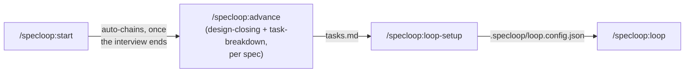

# Specloop

[](LICENSE)
[](https://claude.com/claude-code)

Bootstrapping a new project the same way every time — interview yourself about
scope and stack, write it down, break it into a backlog, then work through that
backlog — is tedious enough to automate. Specloop is a set of skills that does
exactly that: it interviews you, turns the answers into a roadmap you can build
step by step, and then runs a CLI-agnostic loop, right in the chat session
you're already in, to work through it largely unsupervised.

Not software-only — an app, a website, a marketing or content project, an
operations/research project, or anything else that needs a roadmap. The project
type is the first thing the interview establishes, and it branches everything
after it.

## Key concepts

- **Spec** — one feature. Lives in `planning/specs/NNN-name/` as three files, in
  order: `requirements.md` → `design.md` → `tasks.md`.
- **Roadmap** — `planning/roadmap.md`, the single index of every spec: its
  status, dependencies, pipeline stage, and build order.
- **Loop** — the interactive chat session that works through a spec's
  `tasks.md`. That session *is* the master; there's no separate process to
  start or watch.
- **Worker / harness** — the harness is the agent CLI itself (Claude Code,
  OpenCode, Codex CLI, ...); a worker is one instance of it running a single
  task. The loop always runs tasks through its own harness's native sub-agent
  tool first — other configured harnesses exist for portability, not for
  splitting load, unless you explicitly ask it to send work to one.
- **`.specloop/`** — the loop's own state/config folder inside the target repo:
  `loop.config.json`, the interview's coverage log, and run logs.

Everything below builds on these five terms.

## What this is

Skills, in the open [Agent Skills](https://github.com/agentskills/agentskills)
format. Distributed today as a [Claude Code](https://claude.com/claude-code)
plugin for convenient installation — the same `SKILL.md` format is also read
natively by Cursor, Codex CLI, Gemini CLI, OpenCode and others. OpenCode is
live-verified (discovery, auto-trigger, and the interview's write-as-you-go loop
all confirmed); Cursor and Codex CLI parity is tracked but not yet audited (see
`planning/roadmap.md`'s `022`).

## Demo



<!--
Captured material, dropped into .github/assets/ once generated (planning/specs/019):
- demo-interview.gif / demo-interview.png — a real /specloop:start session.
- a real /specloop:loop session demo, still to be captured — see 019's tasks.md.
-->

<p align="center">
  <br>
  <sub>A live <code>/specloop:start</code> interview, running under OpenCode — one
  question at a time, written to disk as it lands. Also runs under Claude Code via
  the plugin install above.</sub>
</p>

## Install

```
claude --plugin-dir /path/to/specloop
```

(from inside the repo you want to bootstrap — not from this repo itself).

For a harness that doesn't read `.claude-plugin/plugin.json`, there's no manifest to
install — copy this repo's `skills/` directory into wherever that harness scans for
skills. Per each harness's own docs:

- **Codex CLI** — copy `skills/` to `.agents/skills/` in the target repo (Codex walks
  up from the current directory to the repo root looking for
  `.agents/skills/<name>/SKILL.md`), or `~/.agents/skills/` for a global install.
  Auto-detected, no flag to enable. Source:
  [OpenAI's build-skills guide](https://developers.openai.com/codex/skills).
- **OpenCode** — copy `skills/` to `.opencode/skills/`, or either of the two aliases
  OpenCode also reads, `.agents/skills/` or `.claude/skills/`, walking up to the git
  worktree root; `~/.config/opencode/skills/` (or `~/.agents/skills/`,
  `~/.claude/skills/`) for a global install. Source:
  [OpenCode's skills doc](https://opencode.ai/docs/skills/).
- **Any other Agent-Skills-compatible harness** — `.agents/skills/` is the
  vendor-neutral path to try first, or a global home-directory equivalent.

These are the paths each harness's own documentation says it scans — not a claim that
the skill *behaves* the same once discovered there. OpenCode's actual behavior
(discovery, auto-trigger, the interview's write-as-you-go loop) is live-verified;
Codex CLI and Cursor are not — see `planning/roadmap.md`'s `022`.

## Quickstart

Run these skills from inside your **target** repo, whenever each is actually ready.
Only one link in this chain is automatic — `/specloop:start` chains straight into
`/specloop:advance` once every seeded spec's requirements are filled; everything
else is still one at a time, deliberately, never auto-triggered:

1. **`/specloop:start`** — "I need to set up X". Scaffolds `AGENTS.md` + `CLAUDE.md` +
   `planning/{product,architecture,roadmap}.md` + `.specloop/`, then runs the interview:
   project type → goal/audience/MVP → technologies, architecture and tools →
   recommended skills/plugins already available in your session → styles and
   preferences. Each answer is written to disk as it lands, the roadmap is seeded from
   all of it, and each spec's `requirements.md` is filled in roadmap order.

   The interview is exhaustive by contract, not by script: it draws from a
   per-project-type question bank, tracks coverage in `.specloop/interview.md`, follows
   up on anything you named but didn't specify, and won't end a phase until a closing
   sweep comes back clean. A dimension you skip is recorded as skipped, not
   quietly dropped.

   Project deliverables (`README.md`, `CONTRIBUTING.md`, `LICENSE`, CI config) are
   specs the roadmap decides, not files this skill assumes.

   Once every seeded spec's requirements are filled, this chains straight into
   `/specloop:advance` (below) — no separate invocation needed for that first pass.
2. **`/specloop:advance`** — auto-chained from step 1, or run directly any time to
   pick up a spec deferred earlier. For every spec still short of `tasks_ready`, it
   closes `design.md` then `tasks.md` in turn, deriving its answers from what the
   interview already established rather than re-asking, showing you the real draft
   for a yes/changes/defer, and asking live only when something genuinely can't be
   inferred. Internally this is `/specloop:design-closing` then `/specloop:task-breakdown`
   (below) — same logic, not a rewrite — just chained per spec instead of run by
   hand each time.
3. **`/specloop:design-closing`** — closes a single spec's `design.md` via guided
   Q&A, and appends any stack/convention decisions it settles to
   `planning/architecture.md` and `AGENTS.md`. Run it directly whenever you want to
   work one spec by hand instead of through `/specloop:advance`'s batch flow.
4. **`/specloop:task-breakdown`** — drafts and confirms a single spec's `tasks.md`
   (single-action, verifiable tasks), marking each `agent` or `human` so the loop
   only attempts what an agent can actually finish. Written as a GFM checkbox list
   with zero-padded IDs (`- [ ] T001 [agent] [status:todo] ...`) — the same
   convention GitHub spec-kit uses, so it renders and reads like any other task
   list, while the `[owner]`/`[status:...]` tags carry the agent/human split and
   5-state status a plain checkbox can't. Also runs directly, same as
   `design-closing` above.
5. **`/specloop:loop-setup`** — one-time step: asks which worker CLI(s) to use and
   writes `.specloop/loop.config.json`. Nothing to install — the loop folder's
   config already exists from step 1; this fills in the rest.
6. **`/specloop:loop`** — the only way to run it: this chat session is the master.
   It reads the roadmap and tasks itself, works every eligible spec in turn
   (or just one, if you name it), and runs tasks **always through your own
   harness's own native sub-agent tool** — never splitting work across the
   other configured providers, those are for portability if a different
   session ever runs this repo's loop. Independent tasks in a batch run as
   parallel sub-agents; anything sharing a file, or whose independence isn't
   clear, runs one at a time. Asks you directly if it looks like it hit a
   usage/rate limit — no separate process, no script, nothing to watch
   elsewhere. Tell it to stop and it does, marking the in-flight task(s)
   `interrupted` and reporting what's left. You can also explicitly send a
   different spec to a different configured provider to run alongside it
   (e.g. "do `007` yourself, send `008` to `codex`") — real cross-provider
   parallelism, only when you ask for it.

Available any time, not part of that sequence:

- **`/specloop:status`** — read-only, reports the roadmap's state (active
  spec(s), task counts, anything stuck, what to run next, and any recorded
  `Stage`/`Status` that disagrees with the files on disk) as a chat summary, and
  writes a static `planning/dashboard.html` — regenerated fully each time you
  ask, never a background process. Works even before `/specloop:loop-setup` has
  run. The only skill with a runtime dependency beyond your harness: it runs
  `skills/status/scripts/build_dashboard.py`, which needs `python3` on `PATH`
  (standard library only, nothing to `pip install`). This repo's own dashboard
  is also published live at
  [sebasscontreras.github.io/specloop](https://sebasscontreras.github.io/specloop/),
  rebuilt by a GitHub Actions workflow on every push to `main` that touches
  `planning/`.
- **`/specloop:amend`** — revises an already-advanced spec: edit its
  `requirements.md`, or reopen a closed `design.md` for changes. Refuses outright
  if any of that spec's tasks is `in_progress` (the loop might be actively
  working it), and always asks for explicit confirmation before touching
  anything already closed. Never chained automatically by any other skill.
- **`/specloop:fix`** — logs one entry in `planning/fix/`: a correction to
  something found wrong after the fact, not a new spec. No interview, no
  phases — a short set of questions and it writes the file. This is the only
  supported way to add an entry there.

## Docs

- [`planning/handoff.md`](planning/handoff.md) — where the work stands, what's next, and what
  is deliberately not yet verified. Read this first if you're picking the project up.
- [`planning/product.md`](planning/product.md) — what this is, who it's for.
- [`planning/architecture.md`](planning/architecture.md) — stack, conventions, resolved,
  open, and declined design decisions.
- [`planning/roadmap.md`](planning/roadmap.md) — index of every spec, status, dependencies.
- [`planning/specs/`](planning/specs/) — one folder per spec: `requirements.md`,
  `design.md`, `tasks.md`.
- [`planning/fix/`](planning/fix/) — a flat log of anything found wrong after the
  fact and its correction, one entry per file, logged via `specloop:fix`
  (`skills/fix/`). Not loop-runnable, not roadmap-tracked.
- [`examples/`](examples/) — a worked `requirements.md` → `design.md` →
  `tasks.md` example and a sample `.specloop/loop.config.json`, so you can see
  what a skill's output actually looks like before running one.
- [`CHANGELOG.md`](CHANGELOG.md) — what has shipped, by spec, in delivery order.
  (`planning/roadmap.md` is direction/status; this is delivered history.)

## Status

Personal project, shared as-is — no support SLA, but issues/PRs are welcome. See
[`CONTRIBUTING.md`](CONTRIBUTING.md) for the workflow and local dev commands, and
[`SECURITY.md`](SECURITY.md) to report a vulnerability privately.

## License

[MIT](LICENSE)
