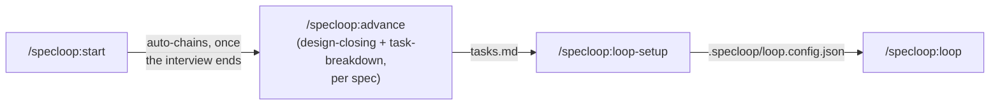
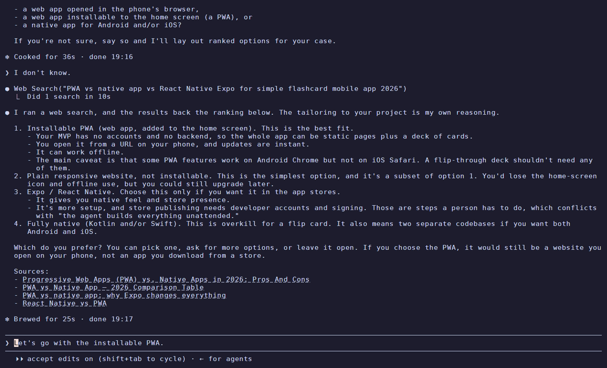
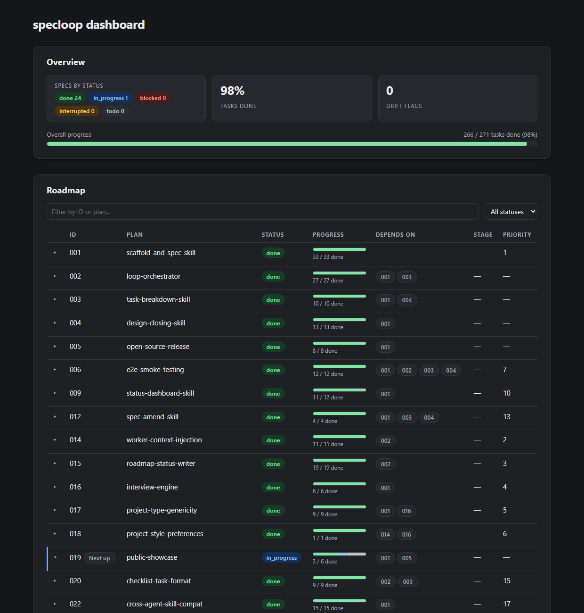

# Specloop

[](LICENSE)
[](#support-matrix)

Bootstrapping a new project the same way every time — interview yourself about
scope and stack, write it down, break it into a backlog, then work through that
backlog — is tedious enough to automate. Specloop is a set of skills that does
exactly that: it interviews you, turns the answers into a roadmap you can build
step by step, and then runs a CLI-agnostic loop, right in the chat session
you're already in, to work through it largely unsupervised.

Not software-only — an app, a website, a marketing or content project, an
operations/research project, or anything else that needs a roadmap. The project
type is the first thing the interview establishes, and it branches everything
after it.

## Key concepts

- **Spec** — one feature. Lives in `planning/specs/NNN-name/` as three files, in
  order: `requirements.md` → `design.md` → `tasks.md`.
- **Roadmap** — `planning/roadmap.md`, the single index of every spec: its
  status, dependencies, pipeline stage, and build order.
- **Loop** — the interactive chat session that works through a spec's
  `tasks.md`. That session *is* the master; there's no separate process to
  start or watch.
- **Worker / harness** — the harness is the agent CLI itself (Claude Code,
  OpenCode, Codex CLI, GitHub Copilot CLI, Cursor, Antigravity CLI); a worker
  is one instance of it running a single task. The loop always runs tasks
  through its own harness's native sub-agent tool first — other configured
  harnesses exist for portability, not for splitting load, unless you
  explicitly ask it to send work to one.
- **`.specloop/`** — the loop's own state/config folder inside the target repo:
  `loop.config.json`, the interview's coverage log, and run logs.

Everything below builds on these five terms.

## What this is

Skills, in the open [Agent Skills](https://github.com/agentskills/agentskills)
format, verified on six agent CLIs: Claude Code, OpenCode, Codex CLI, GitHub Copilot CLI,
Cursor and Antigravity CLI. Install and usage for each is under [Install](#install); the
[support matrix](#support-matrix) has the state per harness and says what "verified" does
and doesn't cover (audit tracked in `planning/roadmap.md`'s `022`). Claude Code also gets a
plugin for convenient installation; every other harness reads the `skills/` folder directly.

## Demo



<!--
Captured material lives in .github/assets/ (planning/specs/019):
- demo-interview-claude.gif and claude-*.png — a real /specloop:start session under Claude Code.
- the same interview under Codex CLI and OpenCode, and a real /specloop:loop session demo,
  still to be added — see 019's tasks.md.
-->

<p align="center">
  <br>
  <sub>A real <code>/specloop:start</code> interview under Claude Code, shortened. It asks
  one question at a time and writes each answer to disk as it lands. The same skills run
  under the other harnesses in the support matrix below.</sub>
</p>

<p align="center">
  <br>
  <sub>Answering "I don't know" to a technical choice makes it search the web and rank
  options with sources. It records only the one you pick.</sub>
</p>

<p align="center">
  <br>
  <sub>The dashboard <code>/specloop:status</code> generates, here for this repo's own
  roadmap: progress per spec, dependencies and the next spec to run.
  <a href="https://sebasscontreras.github.io/specloop/">Live version</a>.</sub>
</p>

## Install

specloop is a folder of skills (`skills/`). Installing it means making your agent CLI see
that folder from the repo you want to bootstrap — your **target** repo, not this one.

### Marketplace

For native marketplace installation:

```bash
claude plugin marketplace add SebassContreras/specloop && claude plugin install specloop@specloop
copilot plugin marketplace add SebassContreras/specloop && copilot plugin install specloop@specloop
```

Both clone the whole repository (assets and planning docs included). For a lean install,
use the installer below. Codex CLI, Cursor, OpenCode and Antigravity CLI have no
verified marketplace flow here; they use the installer.

### Installer

From the target repo, download the lean release (skills plus the plugin metadata) with:

```bash
curl -fsSL https://raw.githubusercontent.com/SebassContreras/specloop/main/install.sh | bash
```

or in PowerShell:

```powershell
irm https://raw.githubusercontent.com/SebassContreras/specloop/main/install.ps1 | iex
```

The installer places skills in `.agents/skills/` (and in `.claude/skills/` when a `.claude/`
directory exists) and skips a folder that already has them — pass `--force` (`-Force` in
PowerShell) to overwrite, `--global` (`-Global`) for your home directory. With `curl | bash`
the flags go after `bash -s --`. The six verified harnesses use these one-line install paths:

| Harness | One-liner |
| --- | --- |
| Claude Code | `claude plugin marketplace add SebassContreras/specloop && claude plugin install specloop@specloop` |
| OpenCode | `curl -fsSL https://raw.githubusercontent.com/SebassContreras/specloop/main/install.sh \| bash` |
| Codex CLI | `curl -fsSL https://raw.githubusercontent.com/SebassContreras/specloop/main/install.sh \| bash` |
| GitHub Copilot CLI | `copilot plugin marketplace add SebassContreras/specloop && copilot plugin install specloop@specloop` |
| Cursor | `curl -fsSL https://raw.githubusercontent.com/SebassContreras/specloop/main/install.sh \| bash` |
| Antigravity CLI | `curl -fsSL https://raw.githubusercontent.com/SebassContreras/specloop/main/install.sh \| bash` |

### Manual copy

The fallback remains a direct copy of the unchanged `skills/` folder:

```
mkdir -p .agents && cp -r /path/to/specloop/skills .agents/skills
```

or in PowerShell:

```
New-Item -ItemType Directory -Force .agents | Out-Null
Copy-Item -Recurse C:\path\to\specloop\skills .agents\skills
```

This preserves backward compatibility with `cp -r /path/to/specloop/skills .agents/skills`
and with Claude Code's existing `claude --plugin-dir /path/to/specloop` install.

Then pick your harness below. You don't need a command name to start: in every non-Claude
harness audited, a plain request activated the right skill unprompted — "I need to set up
a new project and get it organized from scratch." for `start`, "where are we? give me the
status of this project's roadmap" for `status`. The `/specloop:<name>` form used in the
[Quickstart](#quickstart) is Claude Code's plugin namespace.

The *Headless* bullets are for scripts and CI (no interactive session); ordinary use needs
none of those flags. Several grant the CLI permission to run commands and write files
without asking, so use them in throwaway or trusted repos only.

### Claude Code

- **CLI:** [claude.com/claude-code](https://claude.com/claude-code).
- **Install specloop:** from your target repo, `claude --plugin-dir /path/to/specloop`.
  Skills are namespaced: `/specloop:start`, `/specloop:status`, ... Or copy `skills/` to
  `.claude/skills/`.
- **Context:** `CLAUDE.md` is a one-line import of `AGENTS.md`, which Claude Code resolves.
- **Headless:** `claude -p "<prompt>" --plugin-dir /path/to/specloop --allowedTools Bash Read`.

### OpenCode

- **CLI:** [opencode.ai](https://opencode.ai). Works with whichever model it is configured
  for (audited with a model that is neither Anthropic's nor OpenAI's).
- **Install specloop:** copy `skills/` to `.agents/skills/`. It also reads `.opencode/skills/`
  and `.claude/skills/`; globally `~/.config/opencode/skills/` or `~/.agents/skills/`.
  [Its skills doc](https://opencode.ai/docs/skills/).
- **Context:** reads `AGENTS.md`.
- **Headless:** `opencode run "<prompt>"`; add `--format json` for raw events.

### Codex CLI

- **CLI:** `pnpm add -g @openai/codex`, then sign in per its
  [docs](https://developers.openai.com/codex/skills).
- **Install specloop:** copy `skills/` to `.agents/skills/` (globally `~/.agents/skills/`).
  Auto-detected, no flag to enable.
- **Context:** reads `AGENTS.md`.
- **Headless:** `codex exec "<prompt>"`; continue with `codex exec resume --last`; add
  `--json` for events.
- **Windows:** leave the sandbox mode at your own configuration's default. Forcing
  `-s workspace-write` made Codex reject every process it tried to start.

### GitHub Copilot CLI

- **CLI:** `pnpm add -g @github/copilot` or `winget install GitHub.Copilot`, then
  `copilot login` ([docs](https://docs.github.com/en/copilot/how-tos/copilot-cli/cli-getting-started)).
  The Free plan includes the CLI, with limited credits.
- **Install specloop:** copy `skills/` to `.agents/skills/`. It also reads `.github/skills/` and
  `.claude/skills/`; globally `~/.copilot/skills/` or `~/.agents/skills/`. Check with
  `copilot skill list`.
- **Context:** reads `AGENTS.md` (`copilot instruction list` shows it).
- **Headless:** `copilot -p "<prompt>" --allow-all-tools` — the flag is required in
  non-interactive mode. Name a session with `-n <name>` and continue it with `-r <name>`.

### Cursor

- **CLI:** PowerShell `irm 'https://cursor.com/install?win32=true' | iex`; macOS, Linux or WSL
  `curl https://cursor.com/install -fsS | bash`; then `cursor-agent login`
  ([docs](https://cursor.com/docs/cli/overview)). The command is `cursor-agent` (the
  installer also creates `agent`). Audited on the Free plan.
- **Install specloop:** copy `skills/` to `.agents/skills/` (or `.cursor/skills/`); the CLI loads
  them. It also loads skills from your `~/.claude/skills` and its own built-ins, one of which is
  also named `loop` — check which one answers.
- **Context:** reads `AGENTS.md`.
- **Headless:** `cursor-agent -p "<prompt>" --trust --force`. `--trust` is required (otherwise it
  stops at "Workspace Trust Required"); `--force` lets it write files and run commands without
  asking. Continue with `cursor-agent create-chat`, then `--resume <id>`.

### Antigravity CLI

- **CLI:** PowerShell `irm https://antigravity.google/cli/install.ps1 | iex`; macOS or Linux
  `curl -fsSL https://antigravity.google/cli/install.sh | bash`
  ([docs](https://antigravity.google/docs/cli/install)). The command is `agy`. Sign in once by
  running `agy` interactively with a Google account: headless mode before that prints a URL
  and times out.
- **Install specloop:** copy `skills/` to `.agents/skills/`.
- **Context:** reads `AGENTS.md`. Its own data lives in `~/.gemini/antigravity-cli`.
- **Headless — read this:** `agy -p "<prompt>" --add-dir /absolute/path/to/repo --mode accept-edits`.
  `--add-dir` is required, with an **absolute** path (`.` did not work): without it `agy -p`
  loads only its built-in skills. Continue with `--conversation <id>` (the id is in the `init`
  event of `--output-format stream-json`).
- **Limits:** headless mode soft-denies any shell command (exit 0, a notice on stderr), and the
  agent reaches for one even for simple tasks: a create-one-file check wrote nothing under
  `--mode accept-edits`. An allow rule in `~/.gemini/antigravity-cli/settings.json` lifts that:
  `{"permissions": {"allow": ["command(regex:Get-ChildItem.*)"]}}` ran the command in headless
  mode (agy 1.2.7, Windows), although an
  [open GitHub issue](https://github.com/google-antigravity/antigravity-cli/issues/548) says it
  doesn't. A plain `command(<text>)` must equal the whole command, arguments included; `regex:`
  matches a prefix. With rules for the commands it needs, a create-one-file task succeeded both as a
  subprocess and through its native sub-agent. Avoid `--dangerously-skip-permissions`: in the audit
  the agent then read files outside the repo. In headless mode the master's turn ends right after
  it dispatches a sub-agent, so it needs a further turn to collect the result (not verified: the
  account's quota ran out first — HTTP 429, reset about 7 days out). Interactive mode was not audited.

### Any other harness

`.agents/skills/` is the vendor-neutral path to try first, or a global home-directory
equivalent. The paths in the matrix below are what each harness's own documentation says it
scans — not a claim that the skill behaves the same once discovered there. Only a `verified`
row is that claim.

### Support matrix

Per-harness state, the only place it is listed (`planning/specs/022-cross-agent-skill-compat`).
`documented` is interim — the harness's own docs name where it scans for skills, nothing
more; a row ends as `verified` (the four audit checks passed) or `discarded` (with a reason).

**What `verified` covers:** the four checks — skills are discovered, a plain request activates the
right one unprompted (`start` and `status` were the two tried), the `when_to_use` frontmatter key is
tolerated, and `start`'s interview holds one question per turn while writing each answer to disk
first. That interview was audited through its opening phase. **Not covered:** its later phases,
`advance`, and `skills/loop` as the master under the five non-Claude harnesses (the loop's live run,
`024`, was under Claude Code).

| Harness | State | Skills scan path (project · global) | Evidence |
| --- | --- | --- | --- |
| Claude Code | verified | `.claude/skills/`, or `--plugin-dir` · `~/.claude/skills/` | native host; live `claude --plugin-dir` runs: `001` T030 (interview), `006` T010 (pipeline), `024` (loop) |
| OpenCode | verified | `.opencode/skills/`, `.agents/skills/`, `.claude/skills/` · `~/.config/opencode/skills/`, `~/.agents/skills/` | `022` T003 |
| Codex CLI | verified | `.agents/skills/` · `~/.agents/skills/` | `022` T002 (agent-driven run, all four checks) |
| Cursor | verified | `.agents/skills/`, `.cursor/skills/` · `~/.agents/skills/`, `~/.cursor/skills/` | [skills](https://cursor.com/docs/skills), [CLI](https://cursor.com/docs/cli/overview) (command `cursor-agent`, also `agent`); `022` T001 (agent-driven run, all four checks; the CLI does load skills) |
| Antigravity CLI | verified | `.agents/skills/` (project; global path not found) | [install](https://antigravity.google/docs/cli/install), [skills codelab](https://codelabs.developers.google.com/antigravity/how-to-create-agent-skills-for-antigravity-cli) (command `agy`, `-p`; needs `--add-dir` in headless mode); `022` T013 (agent-driven run, all four checks); Google's docs don't say whether a free account works |
| GitHub Copilot CLI | verified | `.github/skills/`, `.claude/skills/`, `.agents/skills/` · `~/.copilot/skills/`, `~/.agents/skills/` | [docs](https://docs.github.com/en/copilot/concepts/agents/about-agent-skills); `022` T026 (agent-driven run, all four checks) |

## Quickstart

Run these skills from inside your **target** repo, whenever each is actually ready.
Command names below use Claude Code's `/specloop:<name>` form. Under every other harness
the skills carry no `specloop:` prefix: say what you want in plain words (see
[Install](#install)), or invoke the skill by its bare name (`start`, `advance`, `status`,
...) if your harness offers that.
Only one link in this chain is automatic — `/specloop:start` chains straight into
`/specloop:advance` once every seeded spec's requirements are filled; everything
else is still one at a time, deliberately, never auto-triggered:

1. **`/specloop:start`** — "I need to set up X". Interviews you first — project type →
   goal/audience/MVP — then scaffolds `AGENTS.md` + `CLAUDE.md` (a one-line import for
   Claude Code) + `planning/{product,architecture,roadmap}.md` + `.specloop/`, and
   carries on: technologies, architecture and tools → recommended skills/plugins
   already available in your session → styles and preferences. Each answer is written
   to disk as it lands, the roadmap is seeded from all of it, and each spec's
   `requirements.md` is filled in roadmap order.

   The interview is exhaustive by contract, not by script: it draws from a
   per-project-type question bank, tracks coverage in `.specloop/interview.md`, follows
   up on anything you named but didn't specify, and won't end a phase until a closing
   sweep comes back clean. A dimension you skip is recorded as skipped, not
   quietly dropped.

   Project deliverables (`README.md`, `CONTRIBUTING.md`, `LICENSE`, CI config) are
   specs the roadmap decides, not files this skill assumes.

   Once every seeded spec's requirements are filled, this chains straight into
   `/specloop:advance` (below) — no separate invocation needed for that first pass.
2. **`/specloop:advance`** — auto-chained from step 1, or run directly any time to
   pick up a spec deferred earlier. For every spec still short of `tasks_ready`, it
   closes `design.md` then `tasks.md` in turn, deriving its answers from what the
   interview already established rather than re-asking, showing you the real draft
   for a yes/changes/defer, and asking live only when something genuinely can't be
   inferred. Internally this is `/specloop:design-closing` then `/specloop:task-breakdown`
   (below) — same logic, not a rewrite — just chained per spec instead of run by
   hand each time.
3. **`/specloop:design-closing`** — closes a single spec's `design.md` via guided
   Q&A, and appends any stack/convention decisions it settles to
   `planning/architecture.md` and `AGENTS.md`. Run it directly whenever you want to
   work one spec by hand instead of through `/specloop:advance`'s batch flow.
4. **`/specloop:task-breakdown`** — drafts and confirms a single spec's `tasks.md`
   (single-action, verifiable tasks), marking each `agent` or `human` so the loop
   only attempts what an agent can actually finish. Written as a GFM checkbox list
   with zero-padded IDs (`- [ ] T001 [agent] [status:todo] ...`) — the same
   convention GitHub spec-kit uses, so it renders and reads like any other task
   list, while the `[owner]`/`[status:...]` tags carry the agent/human split and
   5-state status a plain checkbox can't. Also runs directly, same as
   `design-closing` above.
5. **`/specloop:loop-setup`** — one-time step: asks which worker CLI(s) to use (`claude`, `codex`,
   `opencode`, `copilot`, `cursor-agent`, `agy`, or another) and writes `.specloop/loop.config.json`. Nothing to install — the loop folder's
   config already exists from step 1; this fills in the rest.
6. **`/specloop:loop`** — the only way to run it: this chat session is the master.
   It reads the roadmap and tasks itself, works every eligible spec in turn
   (or just one, if you name it), and runs tasks **always through your own
   harness's own native sub-agent tool** — never splitting work across the
   other configured providers, those are for portability if a different
   session ever runs this repo's loop. Independent tasks in a batch run as
   parallel sub-agents; anything sharing a file, or whose independence isn't
   clear, runs one at a time. Asks you directly if it looks like it hit a
   usage/rate limit — no separate process, no script, nothing to watch
   elsewhere. Tell it to stop and it does, marking the in-flight task(s)
   `interrupted` and reporting what's left. You can also explicitly send a
   different spec to a different configured provider to run alongside it
   (e.g. "do `007` yourself, send `008` to `codex`") — real cross-provider
   parallelism, only when you ask for it.

Available any time, not part of that sequence:

- **`/specloop:status`** — read-only, reports the roadmap's state (active
  spec(s), task counts, anything stuck, what to run next, and any recorded
  `Stage`/`Status` that disagrees with the files on disk) as a chat summary, and
  writes a static `planning/dashboard.html` — regenerated fully each time you
  ask, never a background process. Works even before `/specloop:loop-setup` has
  run. The only skill with a runtime dependency beyond your harness: it runs
  `skills/status/scripts/build_dashboard.py`, which needs Python 3 on `PATH`
  as `python3` or `python` (standard library only, nothing to `pip install`). This repo's own dashboard
  is also published live at
  [sebasscontreras.github.io/specloop](https://sebasscontreras.github.io/specloop/),
  rebuilt by a GitHub Actions workflow on every push to `main` that touches
  `planning/`.
- **`/specloop:amend`** — revises an already-advanced spec: edit its
  `requirements.md`, or reopen a closed `design.md` for changes. Refuses outright
  if any of that spec's tasks is `in_progress` (the loop might be actively
  working it), and always asks for explicit confirmation before touching
  anything already closed. Never chained automatically by any other skill.
- **`/specloop:fix`** — logs one entry in `planning/fix/`: a correction to
  something found wrong after the fact, not a new spec. No interview, no
  phases — a short set of questions and it writes the file. This is the only
  supported way to add an entry there.

## Docs

- [`planning/handoff.md`](planning/handoff.md) — where the work stands, what's next, and what
  is deliberately not yet verified. Read this first if you're picking the project up.
- [`planning/product.md`](planning/product.md) — what this is, who it's for.
- [`planning/architecture.md`](planning/architecture.md) — stack, conventions, resolved,
  open, and declined design decisions.
- [`planning/roadmap.md`](planning/roadmap.md) — index of every spec, status, dependencies.
- [`planning/specs/`](planning/specs/) — one folder per spec: `requirements.md`,
  `design.md`, `tasks.md`.
- [`planning/fix/`](planning/fix/) — a flat log of anything found wrong after the
  fact and its correction, one entry per file, logged via `specloop:fix`
  (`skills/fix/`). Not loop-runnable, not roadmap-tracked.
- [`examples/`](examples/) — a worked `requirements.md` → `design.md` →
  `tasks.md` example and a sample `.specloop/loop.config.json`, so you can see
  what a skill's output actually looks like before running one.
- [`CHANGELOG.md`](CHANGELOG.md) — what has shipped, by spec, in delivery order.
  (`planning/roadmap.md` is direction/status; this is delivered history.)

## Status

Personal project, shared as-is — no support SLA, but issues/PRs are welcome. See
[`CONTRIBUTING.md`](CONTRIBUTING.md) for the workflow and local dev commands, and
[`SECURITY.md`](SECURITY.md) to report a vulnerability privately.

## License

[MIT](LICENSE)
