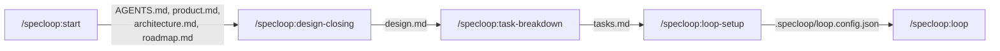

# Specloop

[](LICENSE)
[](https://claude.com/claude-code)

Skills, in the open [Agent Skills](https://github.com/agentskills/agentskills) format,
that unify how a project gets started and kept moving: they interview you, turn the
answers into a roadmap that can be built step by step, and then run a CLI-agnostic loop
— right in the chat session you're already in — to work through that roadmap. Distributed today as
a [Claude Code](https://claude.com/claude-code) plugin for convenient installation —
the same `SKILL.md` format is also read natively by Cursor, Codex CLI, Gemini CLI,
OpenCode and others. OpenCode is live-verified (discovery, auto-trigger, and the
interview's write-as-you-go loop all confirmed); Cursor and Codex CLI parity is
tracked but not yet audited (see `planning/roadmap.md`'s `022`).

Not software-only — an app, a website, a marketing or content project, an
operations/research project, or anything else that needs a roadmap. The project type is
the first thing the interview establishes, and it branches everything after it.

## Demo



<!--
Captured material, dropped into .github/assets/ once generated (planning/specs/019):
- demo-interview.gif / demo-interview.png — a real /specloop:start session.
- a real /specloop:loop session demo, still to be captured — see 019's tasks.md.
-->

<p align="center">
  <br>
  <sub>A live <code>/specloop:start</code> interview, running under OpenCode — one
  question at a time, written to disk as it lands. Also runs under Claude Code via
  the plugin install above.</sub>
</p>

## Install

```
claude --plugin-dir /path/to/specloop
```

(from inside the repo you want to bootstrap — not from this repo itself).

For a harness that doesn't read `.claude-plugin/plugin.json`, there's no manifest to
install — point it at (or copy) this repo's `skills/` directory into wherever that
harness scans for skills. `.agents/skills/` is the vendor-neutral form to reach for
first (several harnesses, including OpenCode, also accept `.opencode/skills/` or
`.claude/skills/` as equivalent aliases, or a global home-directory equivalent). Which
harnesses this has actually been verified against is tracked in `planning/roadmap.md`'s
`022`, not asserted here.

## Quickstart

Run these skills from inside your **target** repo, one at a time, whenever each is
actually ready — none of them chain automatically:

1. **`/specloop:start`** — "I need to set up X". Scaffolds `AGENTS.md` + `CLAUDE.md` +
   `planning/{product,architecture,roadmap}.md` + `.specloop/`, then runs the interview:
   project type → goal/audience/MVP → technologies, architecture and tools →
   recommended skills/plugins already available in your session → styles and
   preferences. Each answer is written to disk as it lands, the roadmap is seeded from
   all of it, and each spec's `requirements.md` is filled in roadmap order.

   The interview is exhaustive by contract, not by script: it draws from a
   per-project-type question bank, tracks coverage in `.specloop/interview.md`, follows
   up on anything you named but didn't specify, and won't end a phase until a closing
   sweep comes back clean twice. A dimension you skip is recorded as skipped, not
   quietly dropped.

   Project deliverables (`README.md`, `CONTRIBUTING.md`, `LICENSE`, CI config) are
   specs the roadmap decides, not files this skill assumes.
2. **`/specloop:design-closing`** — once a spec's requirements are filled, closes its
   `design.md` via guided Q&A, and appends any stack/convention decisions it settles
   to `planning/architecture.md` and `AGENTS.md`.
3. **`/specloop:task-breakdown`** — once a spec's design is closed, drafts and
   confirms a `tasks.md` (single-action, verifiable tasks), marking each `agent` or
   `human` so the loop only attempts what an agent can actually finish. Written as a
   GFM checkbox list with zero-padded IDs (`- [ ] T001 [agent] [status:todo] ...`) —
   the same convention GitHub spec-kit uses, so it renders and reads like any other
   task list, while the `[owner]`/`[status:...]` tags carry the agent/human split and
   5-state status a plain checkbox can't.
4. **`/specloop:loop-setup`** — one-time step: asks which worker CLI(s) to use and
   writes `.specloop/loop.config.json`. Nothing to install — the loop folder's
   config already exists from step 1; this fills in the rest.
5. **`/specloop:loop`** — the only way to run it: this chat session is the master.
   It reads the roadmap and tasks itself, and runs each one **always through your
   own harness's native sub-agent tool first when its provider matches a task's
   configured worker** — a CLI subprocess only when it doesn't — and asks you
   directly if a worker looks like it hit a usage/rate limit — no separate
   process, no script, nothing to watch elsewhere. Tell it to stop and it does,
   marking the in-flight task `interrupted` and reporting what's left.

Available any time, not part of that sequence: **`/specloop:status`** — read-only,
reports the roadmap's state (active spec(s), task counts, anything stuck, what to
run next, and any recorded `Stage`/`Status` that disagrees with the files on disk)
as a chat summary, and writes a static `planning/dashboard.html` — regenerated
fully each time you ask, never a background process. Works even before
`/specloop:loop-setup` has run.

## Docs

- [`planning/handoff.md`](planning/handoff.md) — where the work stands, what's next, and what
  is deliberately not yet verified. Read this first if you're picking the project up.
- [`planning/product.md`](planning/product.md) — what this is, who it's for.
- [`planning/architecture.md`](planning/architecture.md) — stack, conventions, resolved,
  open, and declined design decisions.
- [`planning/roadmap.md`](planning/roadmap.md) — index of every spec, status, dependencies.
- [`planning/specs/`](planning/specs/) — one folder per spec: `requirements.md`,
  `design.md`, `tasks.md`.
- [`planning/fix/`](planning/fix/) — a flat, hand-authored log of anything found
  wrong after the fact and its correction. Not loop-runnable, not roadmap-tracked.
- [`examples/`](examples/) — a worked `requirements.md` → `design.md` →
  `tasks.md` example and a sample `.specloop/loop.config.json`, so you can see
  what a skill's output actually looks like before running one.
- [`CHANGELOG.md`](CHANGELOG.md) — what has shipped, by spec, in delivery order.
  (`planning/roadmap.md` is direction/status; this is delivered history.)

## Status

Personal project, shared as-is — no support SLA, but issues/PRs are welcome. See
[`CONTRIBUTING.md`](CONTRIBUTING.md) for the workflow and local dev commands, and
[`SECURITY.md`](SECURITY.md) to report a vulnerability privately.

## License

[MIT](LICENSE)
