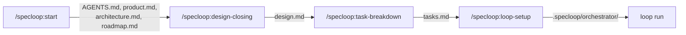

# Specloop

[](LICENSE)
[](https://claude.com/claude-code)

A [Claude Code](https://claude.com/claude-code) plugin that unifies how a project
gets started and kept moving: it interviews you, turns the answers into a roadmap that
can be built step by step, and then runs a CLI-agnostic loop orchestrator in your repo
to work through that roadmap unattended.

Not software-only — an app, a website, a marketing or content project, an
operations/research project, or anything else that needs a roadmap. The project type is
the first thing the interview establishes, and it branches everything after it.

## Demo



<!--
Captured material, dropped into .github/assets/ once generated (planning/specs/019):
- demo-interview.gif / demo-interview.png — a real /specloop:start session.
- demo-loop.gif / demo-loop-status.png / demo-loop-run.png — regenerated from
  .github/assets/demo-loop.tape via `vhs demo-loop.tape`, never re-recorded by hand.
-->

<p align="center">
  <br>
  <sub>A live <code>/specloop:start</code> interview — one question at a time, written to disk as it lands.</sub>
</p>

<p align="center">
  <br>
  <sub><code>loop status</code> then <code>loop run</code> working through a spec's tasks unattended.</sub>
</p>

## Install

```
claude --plugin-dir /path/to/specloop
```

(from inside the repo you want to bootstrap — not from this repo itself).

## Quickstart

Run these skills from inside your **target** repo, one at a time, whenever each is
actually ready — none of them chain automatically:

1. **`/specloop:start`** — "I need to set up X". Scaffolds `AGENTS.md` + `CLAUDE.md` +
   `planning/{product,architecture,roadmap}.md` + `.specloop/`, then runs the interview:
   project type → goal/audience/MVP → technologies, architecture and tools →
   recommended Claude Code skills → styles and preferences. Each answer is written to
   disk as it lands, the roadmap is seeded from all of it, and each spec's
   `requirements.md` is filled in roadmap order.

   The interview is exhaustive by contract, not by script: it draws from a
   per-project-type question bank, tracks coverage in `.specloop/interview.md`, follows
   up on anything you named but didn't specify, and won't end a phase until a closing
   sweep comes back clean twice. A dimension you skip is recorded as skipped, not
   quietly dropped.

   Project deliverables (`README.md`, `CONTRIBUTING.md`, `LICENSE`, CI config) are
   specs the roadmap decides, not files this skill assumes.
2. **`/specloop:design-closing`** — once a spec's requirements are filled, closes its
   `design.md` via guided Q&A, and appends any stack/convention decisions it settles
   to `planning/architecture.md` and `AGENTS.md`.
3. **`/specloop:task-breakdown`** — once a spec's design is closed, drafts and
   confirms a `tasks.md` (single-action, verifiable tasks), marking each `agent` or
   `human` so the loop only attempts what an agent can actually finish. Written as a
   GFM checkbox list with zero-padded IDs (`- [ ] T001 [agent] [status:todo] ...`) —
   the same convention GitHub spec-kit uses, so it renders and reads like any other
   task list, while the `[owner]`/`[status:...]` tags carry the agent/human split and
   5-state status a plain checkbox can't.
4. **`/specloop:loop-setup`** — one-time step: installs the loop orchestrator into
   your repo (`.specloop/orchestrator/`) and puts `loop` on PATH. The loop folder's
   config already exists from step 1; this adds the payload. It no longer refuses on
   an empty backlog — it installs and tells you what's still needed.
5. **`loop run`** — starts working through the roadmap's next eligible spec, task by
   task. `loop stop` triggers a safe stop (marks the in-flight task `interrupted`,
   logs where it left off); `loop status` shows what's running.

## Docs

- [`planning/handoff.md`](planning/handoff.md) — where the work stands, what's next, and what
  is deliberately not yet verified. Read this first if you're picking the project up.
- [`planning/product.md`](planning/product.md) — what this is, who it's for.
- [`planning/architecture.md`](planning/architecture.md) — stack, conventions, resolved,
  open, and declined design decisions.
- [`planning/roadmap.md`](planning/roadmap.md) — index of every spec, status, dependencies.
- [`planning/specs/`](planning/specs/) — one folder per spec: `requirements.md`,
  `design.md`, `tasks.md`.
- [`framework/orchestrator/`](framework/orchestrator/) — the loop orchestrator's
  reference implementation, copied into target repos by `specloop:loop-setup`.
- [`examples/`](examples/) — a worked `requirements.md` → `design.md` →
  `tasks.md` example and a sample `.specloop/loop.config.json`, so you can see
  what a skill's output actually looks like before running one.
- [`CHANGELOG.md`](CHANGELOG.md) — what has shipped, by spec, in delivery order.
  (`planning/roadmap.md` is direction/status; this is delivered history.)

## Status

Personal project, shared as-is — no support SLA, but issues/PRs are welcome. See
[`CONTRIBUTING.md`](CONTRIBUTING.md) for the workflow and local dev commands, and
[`SECURITY.md`](SECURITY.md) to report a vulnerability privately.

## License

[MIT](LICENSE)
